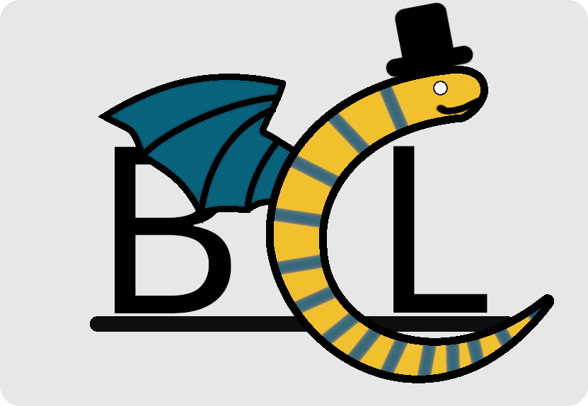

  

# What is BCL?

BCL (BCL Compiled Language) is a compiled programming language that is inspired by python, rust, and other languages.

# Installing via source

To do this you will need:
- LLVM 14 (or LLVM11 if using alternative fork)
- Conda
- Python 3.11+
- SetupTools (`pip install setuptools`)
- Git (required for pip)
- Visual Studio (When on windows)

### Step 1

Clone the git repo

### Step 2

run these commands

#### Step 2.1 (ALL)
This is for all platforms.
**There is only one linux exclusive command.**

```sh
# libs required to compile llvmlite from source/custom fork
## linux gcc stuff, I couldn't get it to compile without this
conda install -c conda-forge libstdcxx-ng=12
## llvm14 install (change 14 to 11 if needed)
conda install -y -q -c numba/label/dev llvmdev="14.*" libxml2
## llvm uses cmake
conda install cmake
```

#### Step 2.2 (WINDOWS)

Installing llvm 11

```sh
# when using a different version of visual studio, do:
set CMAKE_GENERATOR=Visual Studio 17 2022 # an example version of visual studio.
# Install LLVM11. I haven't found a way to use 14 on windows.
pip install git+https://github.com/spidertyler2005/llvmlite.git
```

#### Step 2.2 (LINUX)

Installing llvmlite 14 or 11

```sh
# Installing custom llvmlite fork that has lld for linking (LLVM14)
pip install git+https://github.com/Hassium-Software/llvmlite-lld.git
# Alternatively, if this doesn't work install (LLVM11)
pip install git+https://github.com/spidertyler2005/llvmlite.git
```

#### Step 2.3 (ALL)

installing BCL

```sh
# Installing BCL
pip install .
```

### Step 3

run `bcl <subcommand> <args>` to use BCL!

### How to uninstall

run `pip uninstall Bens_Compiled_Language`

# Example code

```
//  fizzbuzz program
// ===================

import stdlib::*; // will later be an auto-import

define main() {
    for i in 0..100 {
        // printf is in the language, could be used here too!
        print(i);
        print(' ');
        if is_multiple(i, 3) {
            print("fizz");
        }
        if is_multiple(i, 5) {
            print("buzz");
        }
        println();
    }
}

define is_multiple(value: i32, divider: i32) -> bool {
    return (value % divider) == 0;
}
```

# State of the language

The language is *not* fit for production use. It is missing a very large number of features. Although, it is turing-complete.

## Features

- [x] codeblocks
- [x] functions
- [x] function returns
- [x] function arguments
- [x] variable declaration and assignment
- [x] most Operators (now with 100% more bitwise ops)
- [x] boolean operators
- [x] if and else statements
- [x] while loops
- [x] floats
- [x] variable type declaration
- [x] variable assignment-operators (`+=`, `-=`, etc)
- [x] Arrays
- [x] for-loops (only with range literals rignt now)
- [x] references
- [ ] `const`ants
- [x] structs
- [x] struct functions
- [x] struct methods
- [x] struct operator overloading
- [x] struct generic typing
- [ ] protocol types
- [x] generator functions/iterators
- [x] `import` statement with the ability to import modules/packages (WIP, needs namespaces)
- [x] compile a folder or file instead of hardcoded test string.
- [x] heap allocation with garbage collection (`Box::<T>`)
- [x] `malloc` and `free` functions (If you manage your own memory instead of using `Box::<T>`)
- [ ] in-line assembly functionality.
- [ ] make sys-calls
- [x] ~~some access to llvm function directly. (notice: more can, and will, be added)~~ disabled temporarily
- [ ] access to cpu registers.
- [x] standard math library (VERY VERY WIP)
- [x] string (literal)
- [ ] strings (mutable)
- [ ] vectors (WIP)
- [x] stdio library (VERY WIP)
- [x] run-time errors (Error type for errors as values., `Result::<T, E>`)
- [x] Option type (`Optional::<T>`)
- [x] namespaces
- [x] enums
- [x] compiler directives (WIP: adding more directives) 


# VSCode highlighting

There is a folder called `syntax_highlighting`, inside there is a vsix file which you can right click to install. Just note that it's a bit of a work in progress.

# Documentation

Sphinx documentation can be found in the `docs` folder. Note that these docs are not up-to-date yet.

## Stargazers over time
[](https://starchart.cc/ArachnidAbby/BCL)
